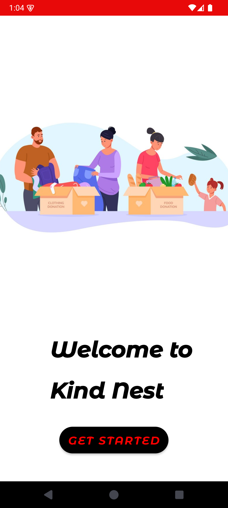

# 🌟 Essentials Connect

> A smart Android application that bridges the gap between **Donors**, **NGOs**, and **Volunteers** for efficient donation and service management.

---

## 📱 About the Project

**Essentials Connect** is a real-time mobile platform built to enable seamless donation, request handling, volunteer management, and tracking. Whether you're a restaurant donating surplus food or an NGO managing distributions, Essentials Connect ensures your resources reach the right hands — fast and efficiently.

---

## 🚀 Features

- 👤 **User Roles:** Donor, NGO, Volunteer, and Admin
- 🍱 **Donation Handling:** Schedule pickups, mark availability, and track delivery
- 📍 **Location Mapping:** Real-time tracking using geo-coordinates
- 🔐 **Login & Role-based Dashboards**
- 🛠️ **Admin Control:** View users, approve NGOs, and monitor activities
- 📈 **Donation Status Page** for up-to-date tracking
- 🌟 **Reward Points System** for encouragement

---

## 🖼️ Screenshots

| Home Page | Donor Dashboard | NGO Dashboard |
|-----------|------------------|----------------|
|  |  |  |

---

## 🛠️ Built With

- 💻 **Java (Android Studio)**
- 🗃️ **Firebase** for real-time database and authentication
- 🧩 **Material Design** for UI components
- 📍 **Google Maps API** (for geo-location)

---

## 📂 Folder Structure

```bash
📦 EssentialsConnect/
├── 📁 app/
│   ├── 📁 activities/
│   ├── 📁 fragments/
│   ├── 📁 models/
│   └── 📁 utils/
├── 📁 assets/
│   └── screenshots/
└── README.md
```

---
## 🧪 How to Run

Follow the steps below to run the Essentials Connect Android app:

1. **Clone this repository**  
   Open your terminal or command prompt and run:
   ```bash
   git clone https://github.com/your-username/essentials-connect.git

